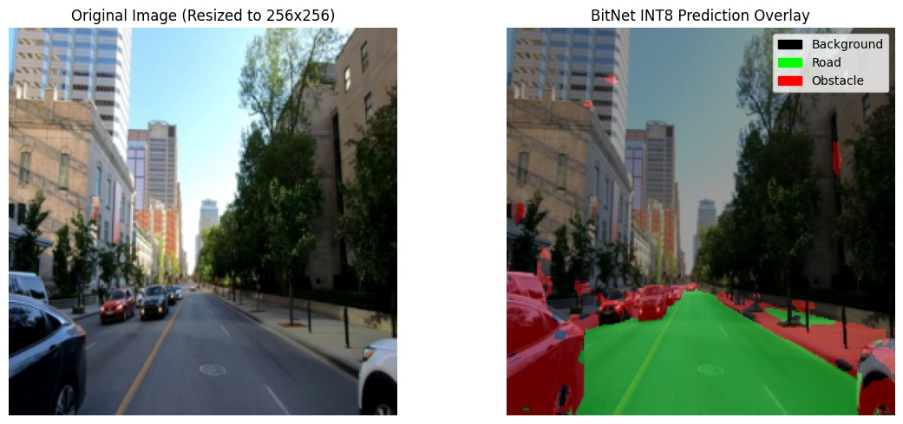

# BitUNet

A 1.58-bit ternary-quantized U-Net for real-time road scene segmentation. The model constrains all interior convolutional weights to {-1, 0, +1} using the absmean quantization scheme from BitNet b1.58, achieving a ~40 MB checkpoint size and 160+ FPS throughput on data center hardware.

## Overview

BitUNet combines two established techniques:

- The encoder-decoder architecture with skip connections from U-Net (Ronneberger et al., 2015), adapted for three-class road scene segmentation (background, road, obstacle).
- The ternary weight quantization from BitNet b1.58 (Ma et al., 2024), which constrains weights to log2(3) = 1.58 bits of information per parameter.

The first encoder block and the final classification head are kept at FP32 precision to preserve input statistics and output boundary resolution. All intermediate layers use ternary convolutions. The base channel count is widened to 72 (from the standard 64) to compensate for the reduced representational capacity of ternary weights.

## Performance

Measured with FP16 asynchronous inference (`predict_video_async_fp16`):

| GPU | Use Case | FPS | Latency |
|-----|----------|-----|---------|
| NVIDIA T4 | Cloud | 53.27 | 17.81 ms |
| NVIDIA RTX 4050 Laptop | Mobile Edge | 41.7 | 19.33 ms |
| NVIDIA RTX A6000 | Data Center | 160.17 | 5.43 ms |

All configurations operate well within the 33.3 ms budget required for 30 FPS real-time video.

## Sample Output




## Requirements

- Python 3.10+
- PyTorch 2.0+ with CUDA support
- OpenCV
- torchvision
- NumPy
- Pillow

Install dependencies:

```bash
pip install -r requirements.txt
```

## Inference

### 1. Prepare test videos

Place road-view video files in the `test_videos/` directory. The model segments three classes: background, road, and obstacle.

```bash
mkdir -p test_videos
# Copy your test videos into this directory
```

### 2. Configure paths

Open `inference.py` and set the input and output video paths:

```python
INPUT_VIDEO_PATH = "test_videos/your_video.mp4"
OUTPUT_VIDEO_PATH = "segmented_output.mp4"
```

### 3. Run inference

```bash
python3 inference.py
```

The script loads the pre-trained weights from `bitnet_ternary_exported.pth`, runs FP16 asynchronous batch inference on the input video, and writes the segmented output with color-coded overlays (green for road, red for obstacle).

### 4. Codec compatibility

If the output video does not play due to codec issues with the default `avc1` codec, re-encode with ffmpeg:

```bash
ffmpeg -i segmented_output.mp4 -c:v libx264 -preset fast -crf 22 playable_output.mp4
```

## Project Structure

```
BitUNet/
├── BitUNet.py                      # Training code: model definition, quantization,
│                                   # datasets, loss functions, scheduler
├── BitUNet.ipynb                   # Training notebook (Jupyter/Colab)
├── inference.py                    # Video inference pipeline (sync, async, FP16)
├── bitnet_ternary_exported.pth     # Pre-trained ternary weights (~40 MB)
├── requirements.txt                # Python dependencies
├── DOCUMENTATION.md                # Detailed technical documentation
├── unet.pdf                        # U-Net reference paper
├── bitnet.pdf                      # BitNet b1.58 reference paper
└── test_videos/                    # Input video directory
```

## Tested Environment

```
OS:                 Linux-6.18.5-arch1-1-x86_64-with-glibc2.42
Python:             3.14.2
PyTorch:            2.10.0+cu128
CUDA (Driver):      13.1
CUDA (PyTorch):     12.8
cuDNN:              91002
Driver Version:     590.48.01
GPU:                NVIDIA GeForce RTX 4050 Laptop GPU
Compute Capability: 8.9
VRAM:               6.05 GB
```

## References

1. Ronneberger, O., Fischer, P., & Brox, T. (2015). U-Net: Convolutional Networks for Biomedical Image Segmentation. arXiv:1505.04597.
2. Ma, S., Wang, H., et al. (2024). The Era of 1-bit LLMs: All Large Language Models are in 1.58 Bits. arXiv:2402.17764.

## License

This project is provided for research and educational purposes.
